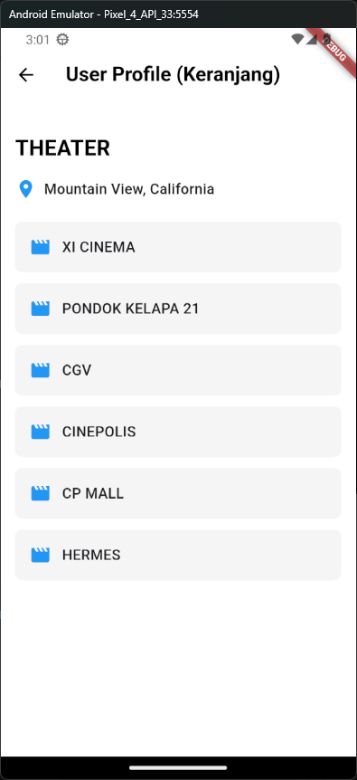

# 🎬 Theater App - Flutter Mobile Application

Aplikasi mobile bioskop yang dibangun menggunakan Flutter dengan fitur login, registrasi, dan daftar bioskop berdasarkan lokasi.

---

## 📱 Fitur Aplikasi

### 1. Authentication System
- **Login Page:** Halaman login dengan validasi email dan password  
- **Signup Page:** Halaman pendaftaran pengguna baru  
- **Social Login:** Opsi login menggunakan Google dan Facebook  
- **Form Validation:** Validasi input form dengan pesan error  

### 2. User Profile & Location
- **Profile Page:** Menampilkan informasi pengguna dan daftar bioskop  
- **Geolocation:** Mendeteksi lokasi pengguna menggunakan GPS  
- **Theater List:** Menampilkan daftar bioskop berdasarkan lokasi  
- **Location Refresh:** Fitur refresh untuk memperbarui lokasi  

### 3. UI/UX Features
- **Custom Logo:** Logo Google dan Facebook yang dibuat manual  
- **Responsive Design:** Tampilan yang responsif di berbagai ukuran layar  
- **Loading States:** Indikator loading untuk proses asynchronous  
- **Error Handling:** Penanganan error dengan snackbar messages  

---

## 🎨 Design & User Interface

### Login Page
- Header **"LOGIN"** dengan typography yang jelas  
- Form input email dan password  
- Tombol **"Forgot Password?"**  
- Social login buttons (Google & Facebook)  
- Navigasi ke halaman signup  

### Signup Page
- Header **"SIGN UP"** sesuai desain  
- Form registrasi: nama lengkap, email, password, konfirmasi password  
- Validasi password match  
- Navigasi ke halaman login  

### Profile Page
- App bar dengan nama pengguna dan tombol logout  
- Card informasi user dengan avatar  
- Section **"THEATER"** dengan lokasi terkini  
- Daftar bioskop dalam bentuk list cards  
- Tombol refresh lokasi  

---

## 📍 Geolocation Features

### Implementasi Geolocator
- Menggunakan package **geolocator** dan **geocoding**  
- Permission handling untuk akses lokasi  
- Fallback location **"MEDAN"** jika GPS tidak tersedia  
- Reverse geocoding (koordinat → nama lokasi)  

### Location Flow
1. Cek status layanan lokasi  
2. Request permission jika diperlukan  
3. Dapatkan koordinat GPS  
4. Konversi ke nama lokasi menggunakan geocoding  
5. Tampilkan lokasi atau fallback ke **"MEDAN"**  

---

## 🔐 Authentication Flow

### Login Process
1. User input email dan password  
2. Validasi form input  
3. Autentikasi dengan database  
4. Redirect ke profile page jika sukses  
5. Tampilkan error message jika gagal  

### Registration Process
1. User input data lengkap  
2. Validasi email uniqueness  
3. Validasi password strength dan match  
4. Simpan user ke database  
5. Auto login dan redirect ke profile  

---

## 🛠️ Technical Implementation

### State Management
- Menggunakan `setState` untuk state management sederhana  
- Loading states untuk operasi asynchronous  
- Error states dengan snackbar notifications  

### Navigation
- `Navigator.push` untuk berpindah halaman  
- `Navigator.pushReplacement` untuk login/signup success  
- `Navigator.pushAndRemoveUntil` untuk logout  

### Dependencies
- `geolocator`: Untuk akses GPS dan lokasi  
- `geocoding`: Untuk konversi koordinat ke alamat  
- `sqflite`: Untuk database lokal SQLite  
- `path`: Untuk operasi path di database  

---

## 📱 Platform Support
### Android
- Permission `ACCESS_FINE_LOCATION`  
- Permission `ACCESS_COARSE_LOCATION`  
- SQLite database support

## Tampilan Login Page

## Tampilan Signup Page

## Tampilan Profile Page

